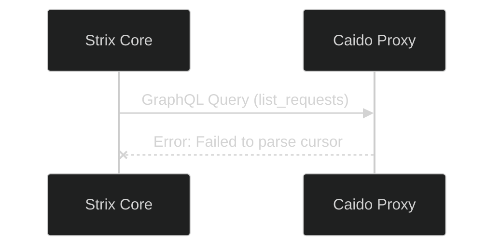

# Troubleshooting & FAQ

Even autonomous systems occasionally need human intervention. This guide covers the most common issues you might encounter while deploying or operating Project Strix, and how to resolve them.

## 1. Scan Fails Immediately on Launch

If a scan immediately enters the `Failed` state or never transitions from `Pending`, check the underlying PM2 and Node.js logs.

```bash
# View the dashboard logs in real-time
sudo pm2 logs strix-dashboard

# Check for past errors
sudo pm2 log strix-dashboard --lines 100
```

**Common Causes:**
- **ENOENT (Agent Not Found):** The system cannot find the `strix` executable. Ensure you ran the `runner/host/deploy.py` script as `root`.
- **API Key Missing:** You selected an LLM provider (like OpenAI) but haven't saved the corresponding API Key in the Settings panel.

## 2. "Database Locked" or Prisma Errors

If you restarted the server forcefully during a database migration, Prisma might lock the database.

> [!TIP]
> The easiest way to self-heal the database is to run the official deployment script again. It is idempotent and will repair broken connections.

```bash
sudo python3 runner/host/deploy.py
```

Alternatively, to manually push the database schema:
```bash
cd strix-dashboard
npx prisma db push --accept-data-loss
```

## 3. Caido Proxy "Failed to parse cursor" Error

If you inspect the Agent Logs and see a Python traceback related to `caido_sdk_client` and `Failed to parse cursor`:



**Reason:** This is a known mismatch between the `strix` CLI and the version of Caido running on the server.
**Solution:** Run `strix --update` to fetch the latest agent binary that contains the patch for this Caido SDK bug.

## 4. UI Does Not Update Real-Time

If Server-Sent Events (SSE) seem broken (you have to refresh to see new logs):
1. Check if you are behind an Nginx reverse proxy.
2. Nginx buffers SSE streams by default. You must disable buffering for the `/api/scans/` path.

```nginx
location /api/scans/ {
    proxy_pass http://127.0.0.1:48080;
    proxy_buffering off;
    proxy_cache off;
    chunked_transfer_encoding on;
}
```

## 5. Podman & Container Lifecycle Troubleshooting

### A. Containers Disappeared or Show `Exited` After PC / WSL Reboot
When WSL2 shuts down or your machine restarts, Podman containers transition to the `Exited` state. Running `sudo podman ps` will appear **empty** because it only shows actively running containers.

1. **Inspect all containers (including stopped ones):**
   ```bash
   sudo podman ps -a
   ```
   *(You may see `STATUS: Exited (0) 292 years ago` — this is a harmless WSL2 timestamp artifact caused by kernel sleep states).*

2. **Wake up the existing stack without rebuilding:**
   You do **not** need to run `./deploy.sh` again. Simply start the existing containers:
   ```bash
   sudo podman start strix-postgres strix-dashboard
   ```
   Verify they are online:
   ```bash
   sudo podman ps
   ```

### B. Safe Rebuild / Upgrade Without Losing Database Data
If you made code changes or pulled new git commits and want to rebuild the container with the latest code, while **preserving your users, scans, API keys, and database history**:

> [!CAUTION]
> **Never run `podman-compose down -v`!**
> The `-v` flag deletes named volumes, permanently erasing your PostgreSQL database (`strix-db-data`).

**The Safe Rebuild Workflow:**
```bash
cd podman

# 1. Stop and remove the old container processes (preserves database volumes)
sudo podman-compose down

# 2. Rebuild the dashboard with fresh code and bring the stack up
sudo podman-compose up -d --build
```
Your database volume `strix-db-data` will automatically re-mount to the new container instance, keeping all your data 100% intact.

### C. "Root vs. Rootless" Container Isolation
Podman maintains completely separate container and volume registries for the `root` user (`sudo podman`) and regular non-root users (`podman`).

- If you installed Strix using `sudo` or `root`:
  Running `podman ps` without `sudo` will show empty. You must use `sudo podman ps`.
- If you accidentally ran `./deploy.sh` without `sudo` and spawned duplicate rootless containers:
  ```bash
  # Clean up the accidental non-root deployment
  cd podman
  podman-compose down

  # Resume using your existing root deployment
  sudo podman start strix-postgres strix-dashboard
  ```

### D. Verifying Database Volume Health
To ensure your database volume is safely stored on the host:
```bash
sudo podman volume ls
```
You should see:
- `strix-db-data` (PostgreSQL user accounts, settings, scan results)
- `strix-runs-data` (Target CLI scan artifacts, terminal logs, and payloads)

