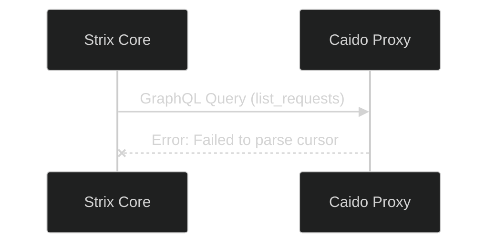

# Troubleshooting & FAQ

Even autonomous systems occasionally need human intervention. This guide covers the most common issues you might encounter while deploying or operating Project Strix, and how to resolve them.

## 1. Scan Fails Immediately on Launch

If a scan immediately enters the `Failed` state or never transitions from `Pending`, check the underlying PM2 and Node.js logs.

```bash
# View the dashboard logs in real-time
sudo pm2 logs strix-dashboard

# Check for past errors
sudo pm2 log strix-dashboard --lines 100
```

**Common Causes:**
- **ENOENT (Agent Not Found):** The system cannot find the `strix` executable. Ensure you ran the `runner/host/deploy.py` script as `root`.
- **API Key Missing:** You selected an LLM provider (like OpenAI) but haven't saved the corresponding API Key in the Settings panel.

## 2. "Database Locked" or Prisma Errors

If you restarted the server forcefully during a database migration, Prisma might lock the database.

> [!TIP]
> The easiest way to self-heal the database is to run the official deployment script again. It is idempotent and will repair broken connections.

```bash
sudo python3 runner/host/deploy.py
```

Alternatively, to manually push the database schema:
```bash
cd strix-dashboard
npx prisma db push --accept-data-loss
```

## 3. Caido Proxy "Failed to parse cursor" Error

If you inspect the Agent Logs and see a Python traceback related to `caido_sdk_client` and `Failed to parse cursor`:



**Reason:** This is a known mismatch between the `strix` CLI and the version of Caido running on the server.
**Solution:** Run `strix --update` to fetch the latest agent binary that contains the patch for this Caido SDK bug.

## 4. UI Does Not Update Real-Time

If Server-Sent Events (SSE) seem broken (you have to refresh to see new logs):
1. Check if you are behind an Nginx reverse proxy.
2. Nginx buffers SSE streams by default. You must disable buffering for the `/api/scans/` path.

```nginx
location /api/scans/ {
    proxy_pass http://127.0.0.1:48080;
    proxy_buffering off;
    proxy_cache off;
    chunked_transfer_encoding on;
}
```
