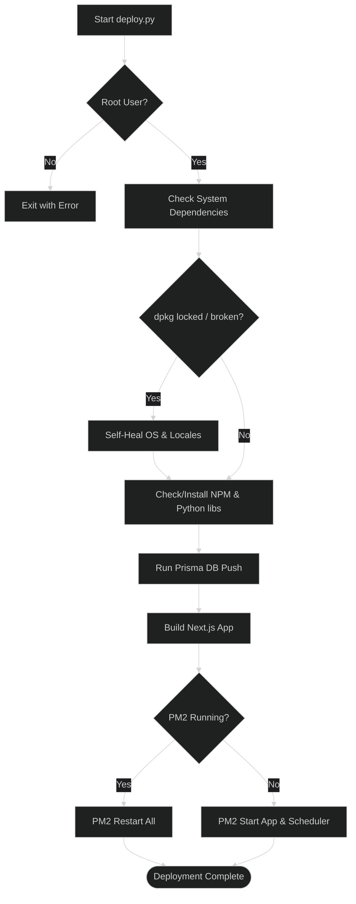

# Updating Strix

As Project Strix is continuously developed, you may want to pull the latest changes, features, and security patches from the GitHub repository to your production server.

## The Auto-Deployer Method

The easiest and safest way to update your Strix deployment is to use the exact same script you used to install it:
- For Native Linux hosts: `runner/host/deploy.py`
- For Podman / Containers: `runner/podman/deploy.py`

1. SSH into your server.
2. Navigate to your installation directory:
   ```bash
   cd ~/ProjectStrix
   ```
3. Fetch the latest code from the main branch and reset your local copy:
   ```bash
   sudo git fetch origin
   sudo git reset --hard origin/main
   ```
4. Run the auto-deployer script:
   ```bash
   # For Host / PM2:
   sudo python3 runner/host/deploy.py

   # Or for Podman:
   python3 runner/podman/deploy.py
   ```

The script will:
- Check for Python/Node/System dependencies.
- Fix broken `dpkg` or missing locales automatically.
- Re-run `npm install` and `npm run build` for the Next.js app.
- Apply new `prisma db push` migrations.
- Gracefully restart the PM2 processes or containers.



## Important Note on Data Loss
Using `runner/host/deploy.py` will run `npx prisma db push --accept-data-loss`. In development phases, this is perfectly fine. However, if structural schema changes occur that delete tables or columns, this command *could* result in data loss for those specific columns. Always back up your PostgreSQL database (`bash runner/host/backup.sh`) before updating critical production environments!
